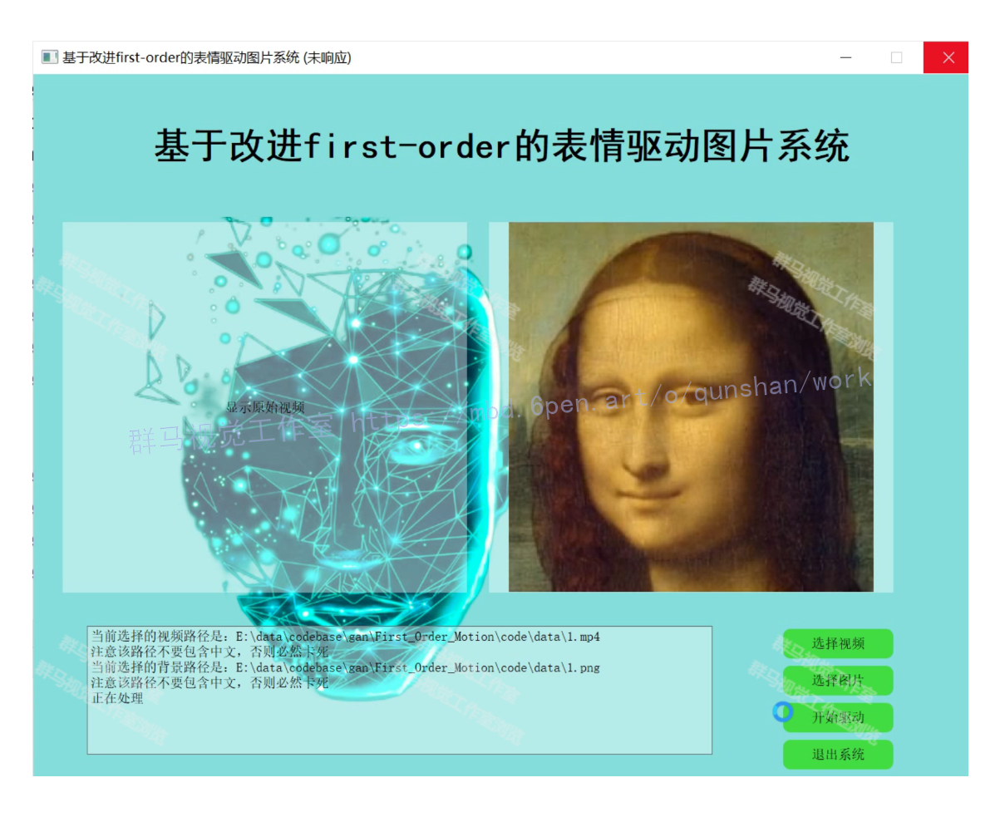
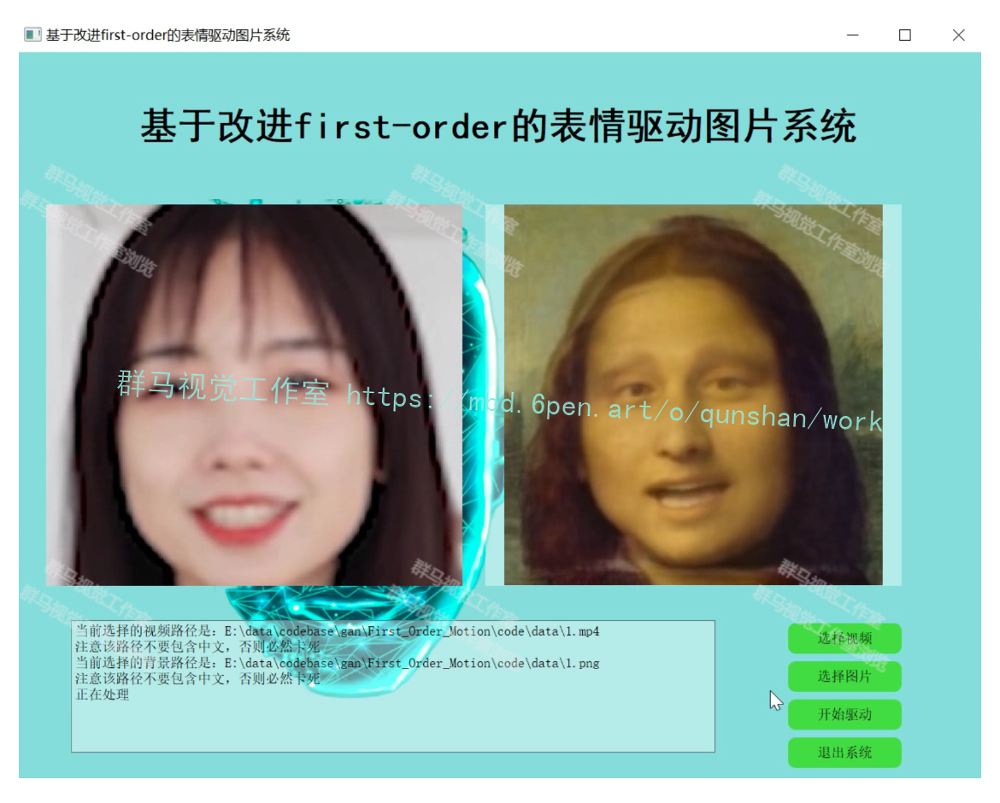
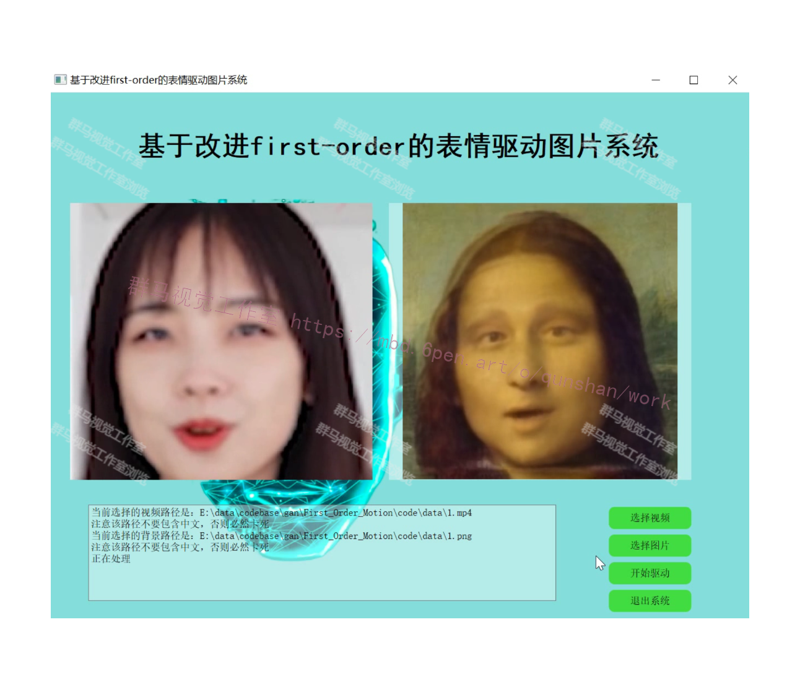
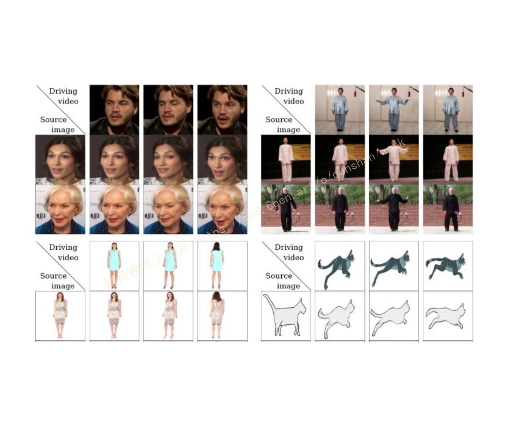
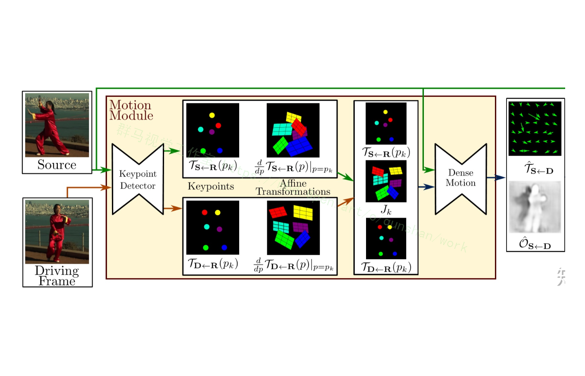
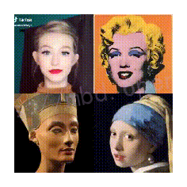

# 1.研究背景
早期的Facerig软件可以即时抓取摄像头视频中的人脸关键点，将表情、头部姿态等信息转化到三维虚拟化身上，比如一只猫、一个虚拟卡通人物上。然后在使用即时视频通讯软件时，选择facerig的虚拟摄像头，其他人看到的就是拥有使用者当前表情的虚拟形象了。

随着换脸、表情迁移的科技浪潮汹涌而至，人们不再满足于使用卡通形象、动漫人物来充当自己的化身，而是使用真人的形象。类似的项目包括但不限于faceit_live3、avatarify，其中avatarify热度较高，已经被用于视频会议的换脸，参见机器之心的报道。

传统意义上的换脸是视频图像帧级别的操作，如果想把源脸替换到目标脸上的话，需要使用大量的双方人脸图像的数据进行事先训练训练。但是上述视频会议场景不具备这个条件，毕竟用户端的目标人脸的数据过少，为了达到实时换脸的效果，也没有大量的时间进行训练，那么[上述项目](https://mbd.pub/o/bread/Y5yWmp9v)是如何实现的呢？

# 2.图片演示

# 3.视频演示
[基于改进First_order的表情驱动图片系统（源码＆教程）_哔哩哔哩_bilibili](https://www.bilibili.com/video/BV1kg411v7b6/?spm_id_from=333.999.0.0&vd_source=bc9aec86d164b67a7004b996143742dc)

# 4.First Order Motion Model简介
从标题显而易见，给定一张源图片，给定一个驱动视频，生成一段视频，其中主角是源图片，动作是驱动视频中的动作。如下图所示，源图像通常包含一个主体，驱动视频包含一系列动作。

以左上角的人脸表情迁移为例，给定一个源人物，给定一个驱动视频，可以生成一个视频，其中主体是源人物，视频中源人物的表情是由驱动视频中的表情所确定的。通常情况下，我们需要对源人物进行人脸关键点标注、进行表情迁移的模型训练。

但是这篇文章提出的方法只需要在同类别物体的数据集上进行训练即可，比如实现太极动作迁移就用太极视频数据集进行训练，想要达到表情迁移的效果就使用人脸视频数据集voxceleb进行训练。训练好后，我们使用对应的预训练模型就可以达到前言中实时image animation的操作。

# 5.提高模型的泛化性

为了解决数据依赖和提高模型使用的泛化性。

以表情迁移为例，图像生成任务的传统方法VAE、GAN等需要大量人脸图像，以及这些人脸图像的标注信息（关键点、面部动作单元、三维模型等）；此外，这些训练好的模型只能在特定人物中间使用，没法应用到未知的人脸中。

除了生成人脸图像的逼真程度，上述两个问题也是长久以来表情迁移所面临的问题。小样本学习是解决上述问题的方法之一，比如三星的工作、英伟达的FUNIT，通过提取少量源人脸的embedding，表征源人脸的身份信息，在生成阶段使用AdaIn加入到decoder中，实现表情迁移的操作。

此外在姿态迁移的大任务当中，Monkey-Net首先尝试了通过自监督范式预测关键点来表征姿态信息，测试阶段估计驱动视频的姿态关键点完成迁移工作。在此基础上，FOMM使用了相邻关键点的局部仿射变换来模拟物体运动，还额外考虑了遮挡的部分，遮挡的部分可以使用image inpainting生成。

整个模型训练过程是图像重建的过程，输入是源图像和驱动图像，输出是保留源图像物体信息的含有驱动图像姿态的新图像，其中输入的两张图像来源于同一个视频，即同一个物体信息，那么整个训练过程就是驱动图像的重建过程。

大体上来说分成两个模块，一个是motion estimation module，另一个是image generation module。其中motion estimation module输出有两个，一个是dense motion field [公式] ，表征了驱动图像D中的每个关键点到源图像S的映射关系；一个是occlusion mask [公式] ，表明了在最终生成的图像中，对于驱动图像D而言，哪部分可以通过D扭曲得到，哪部分可以通过inpaint得到。在image generation module中，输入S，在encoder得到的特征层中进行形变，然后decoder回去，得到最终的输出。

一个很有意思的地方是，在推断过程中，D和S的关键点差异可能会比较大，所以作者引入了一个抽象的参考帧R，通过预测R到S的映射 [公式] 和R到D的映射 [公式] 来计算 [公式] ，这样避免了直接计算D到S的映射，并且可以同时处理D和S。对于输入motion estimation module的一张图片X来说，其中的keypoint detector会输出关键点信息和局部仿射变换的参数信息，这些参数使得关键点附近的姿态信息可以通过仿射变换得到。

# 6.遮挡感知生成器
[本文参考该博客提出的「遮挡感知生成器」](https://afdian.net/item?plan_id=0494613a68ab11ed818e52540025c377)，可以指示源图像中不可见的物体部分，从而利用上下文推断这部分内容。再者为了改进局部仿射变换的估计，作者扩展了常用于关键点检测器训练的等差损耗。最后作者还发布了一个新的高分辨率数据集Thai-Chi-HD，用于评估图像动画和视频生成框架的参考基准。作者根据汽车驾驶视频中类似物体的运动情况，对源图像中描绘的物体进行“动画化”。

没有直接监督，而是采用了一种自监督策略，该策略的灵感来源于Monkey-Net。

注：Monkey-Net是通过深度运动迁移使任意物体动画化。

对于训练，作者使用包含相同对象类别的大量视频序列集合。模型被训练来通过组合单帧和学习的视频中运动的潜在表示来重建训练视频。观察从同一视频中提取的帧对，模型学习将运动编码为特定的关键点位移和局部仿射变换的组合。

在测试时，将模型应用于源图像和驱动视频的每一帧的帧对，并对源对象进行图像“动画”。运动估计模块的作用是估计一个密集的运动场（dense motion field），该密集运动场随后被用来调整计算特征图与物体姿势。

另外，作者采用的是后向光流，因为它可以有效地实现双线采样。运动估计模块没有直接进行预测，而是分两步进行，在第一步中，从稀疏轨迹集近似两个变换，其中两个变换是通过使用自监督方式学习关键点获得的。视频和图像中的关键点由编码器-解码器网络分别预测。

另外，稀疏运动表示非常适合于动画，因为在测试时，可以使用驱动视频中的关键点轨迹来移动源图像的关键点。使用局部仿射变换的好处是能够对每个关键点附近的运动进行建模，与仅使用关键点置换相比，局部仿射变换能够对更大的变换族（ larger family of transformations）进行建模。

在第二步中，密集运动网络结合局部近似以获得密集运动场，除了密集的运动场之外，该网络还输出遮挡遮罩，该遮挡遮罩指示视频中的哪些图像部分可以通过源图像的扭曲来重建，以及哪些部分应该内嵌(即从上下文推断)。

# 7.系统整合
下图[完整源码＆环境部署视频教程＆自定义UI界面](https://s.xiaocichang.com/s/04573f)

参考博客[《基于改进First_order的表情驱动图片系统（源码＆教程）》](https://mbd.pub/o/qunma/work)

# 8.参考文献
***
1. Temporal Generative Adversarial Nets with Singular Value Clipping
2. Generating videos with scene dynamics
3. Every smile is unique: Landmark-guided diverse smile generation
4. Mocogan: Decomposing motion and content for video generation
5. Stochastic variational video prediction
6. Unsupervised learning for physical interaction through video prediction
7. Transformation-based models of video sequences
8. Unsupervised learning for physical interaction through video prediction
9. Action-conditional video prediction using deep networks in atari games
10. Unsupervised learning of video representations using lstms

---
#### 如果您需要更详细的【源码和环境部署教程】，除了通过【系统整合】小节的链接获取之外，还可以通过邮箱以下途径获取:
#### 1.请先在GitHub上为该项目点赞（Star），编辑一封邮件，附上点赞的截图、项目的中文描述概述（About）以及您的用途需求，发送到我们的邮箱
#### sharecode@yeah.net
#### 2.我们收到邮件后会定期根据邮件的接收顺序将【完整源码和环境部署教程】发送到您的邮箱。
#### 【免责声明】本文来源于用户投稿，如果侵犯任何第三方的合法权益，可通过邮箱联系删除。